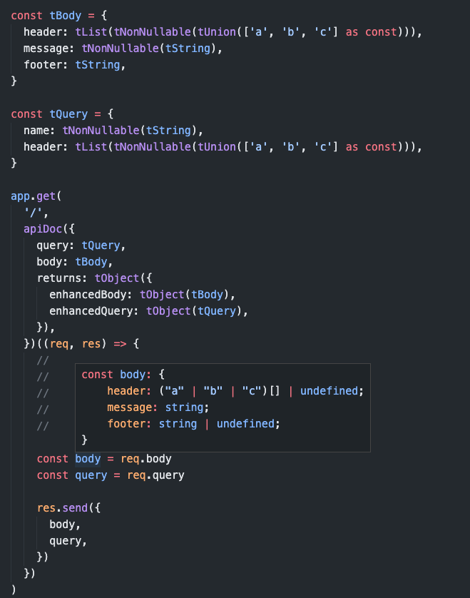
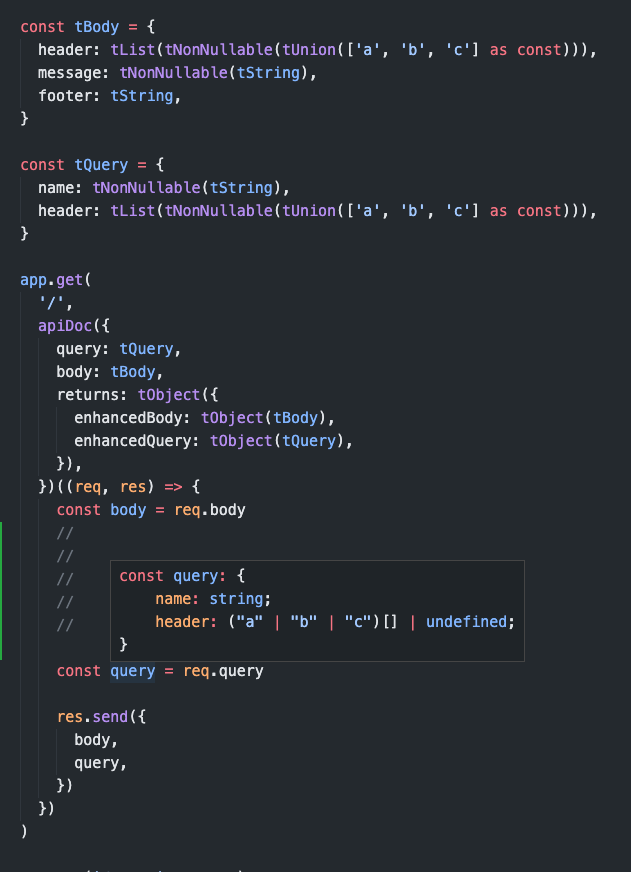
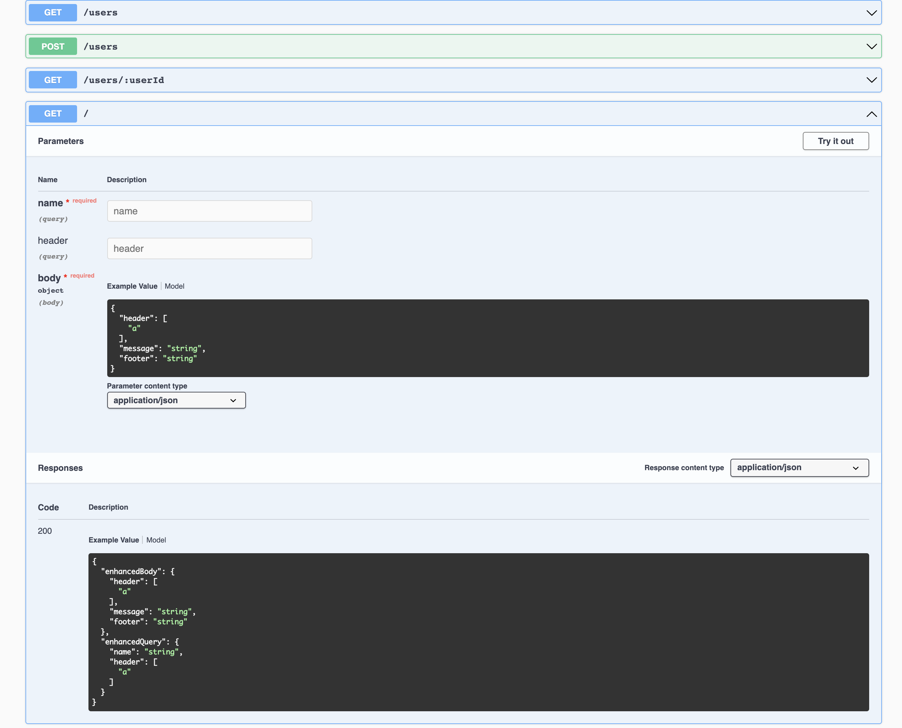

# swagger-typed-express-docs

swagger-typed-express-docs keep you simple document your endpoints with just one single source of truth which

this project generates OpenAPI 3.0.0, not swagger!

- **Generate OpenAPI API documentation**
- **Compile time validations - Infer Typescript static types out of the box**
- **Runtime validate each of your HTTP request with user-friendly error messages**

To do that there is just a simple high-order-function API.
So you can just simply wrap your endpoint with the `apiDoc(...)` and initialize project via `initApiDocs()`

## Example usage

[You can see full app example in the repository:](https://github.com/Svehla/swagger-typed-express-docs/blob/main/example/)

```typescript
import express from 'express'
import { apiDoc, initApiDocs, T } from 'swagger-typed-express-docs'
import swaggerUi from 'swagger-ui-express'

const app = express()
const port = 3000

app.get(
  '/user/:userId',
  /**
   * adding metadata for handlers where we want to have
   *  - runtime checks
   * - compile-time checks
   * - generate swagger documentation
   */
  apiDoc({
    params: {
      userId: T.string,
    },
    query: {
      name: T.string,
      header: T.list(T.enum(['a', 'b', 'c'] as const))),
    },
    body: {
      header: T.list(T.enum(['a', 'b', 'c'] as const))),
      message: T.string,
      footer: T.string,
    },
    returns: T.object({
      enhancedBody: T.object({
        data: T.enum(['a', 'b', 'c'] as const),
      }),
    }),
  })((req, res) => {
    const body = req.body
    const query = req.query

    // res.send is typed by typescript, but it do not transform values by tSchema, so
    // you may use tSend instead
    res.tSend({
      body,
      query,
    })
  })
)
/**
 * before you start the server you have to setup library
 */
const swaggerJSON = initApiDocs(app, { info: { title: 'my application' } })

app.use('/api-docs', swaggerUi.serve, swaggerUi.setup(swaggerJSON))
```

## Package API

The whole library expose 2 main functions: `initApiDocs(...)` and & `apiDoc(...)`

### initApiDocs

This method takes a swagger metadata which will be deeply merged into generated documentation.

`initApiDocs()` returns generated Swagger JSON which you can use to document your API.

[example usage](https://github.com/Svehla/swagger-typed-express-docs/blob/main/tests/schemaBuilder.test.ts#L15)

```typescript
const swaggerJSON = initApiDocs(app, { info: { title: 'my application' } })
```

to make the application work you have to call `initApiDocs()` at the end of routes definition
and before you start `app.listen(...)`

### apiDoc

`apiDoc(...)` is high-order-function which you use to wrap express endpoint handler
and define a meta-information about inputs & outputs of each API handler.

example usage:

```typescript
import { T } from 'swagger-typed-express-docs'

app.get(
  '/',
  apiDoc({
    query: {
      name: T.string
      header: T.list(T.enum(['a', 'b', 'c'] as const))),
    },
    body: {
      header: T.list(T.enum(['a', 'b', 'c'] as const))),
      message: T.null_list,
      footer: T.string,
    },
    returns: T.null_object({
      data: T.null_object({
        nestedData: T.enum(['a', 'b', 'c'] as const),
      }),
    }),
  })((req, res) => {
    const body = req.body
    const query = req.query

    res.send({
      body,
      query,
    })
  })
)
```

The library exposes many functions and objects which help you to create schema as you want.

- `T.string(...)`
- `T.null_string(...)`
- `T.boolean(...)`
- `T.null_boolean(...)`
- `T.number(...)`
- `T.null_number(...)`
- `T.enum(...)`
- `T.null_enum(...)`
- `T.oneOf(...)`
- `T.null_oneOf(...)`
- `T.any(...)`
- `T.null_any(...)`
- `T.object(...)`
- `T.null_object(...)`
- `T.list(...)`
- `T.null_list(...)`
- `T.nonNullable(...)`

if you want to see more examples on how to build schema structure by function compositions
you can check the tests

## Setup environments

### Express body parsing

if you want to parser body, you have to setup body parser express middleware.

```typescript
app.use(express.json())
```

### Typescripts null checks

to make fully work `tNonNullable` you have to setup `tsconfig.json` properly.

```json
{
  ...
  "compilerOptions": {
    ...
    "strictNullChecks": true,
  }
}
```

## Example library preview







## Decisions

if some field in the object is nullable `null_` key may not be required, but in TS types, only value is of type `| undefined`

so the non existed keys are nullable as well, thanks to this, the schema is simplier for the writter, because there is less edge cases to think about

## All defined schema attribute stripping

if you define one of apiDoc objects like `query`, `body`, `params` or `headers` it'll strip all unknown object attributes so omit potential security data injections

By default, if you do not define some of the tSchema, nothing is validate or parsed for current object

### Express query parsing

You can parse query thanks to `express-query-parser` library.

We parser to keep parsing only undefined and null values and the rest may be done by transform types.
Many transform types is predefined in the `T.cast.` object.

```typescript
import { queryParser } from 'express-query-parser'

app.use(
  queryParser({
    parseNumber: false,
    parseBoolean: false,
    // turn on only null & undefined values, to use T.cast. utils
    parseNull: true,
    parseUndefined: true,
  })
)

app.get(
  '/',
  apiDoc({
    query: {
      name: T.cast.number,
      ids: T.extra.null_toListIfNot(T.cast.number),
    },
  })((req, res) => {
    const body = req.body
    const query = req.query

    res.send({
      body,
      query,
    })
  })
)
```

if you want to parse string `'null'` by yourself, you need to create a custom T.transform data type which will handle this edge case

### Validating output via res.tSend

The library automatically injects the `tSend` function into `res.tSend`. This function takes data and sends a 200 success status response.
However, before sending, it verifies if the schema matches the `apiDoc({ returns: ... })` schema definition and sanitizes the data.
Therefore, if you send more data than what is defined (for example, an object with additional attributes),
the surplus data will be stripped. This mechanism enhances the function's reliability.

After defining `T.transform` types, encoders are applied, and the data is transformed accordingly.

### Custom transformation of incoming data (Encoders / decoders)

Data Transformation Flow:
User -> HTTP -> Encoded -> Decoded -> Express Handler
Express Handler -> Decoded -> Encoded -> HTTP -> User

- Users interact exclusively with encoded types.
- Express handlers interact solely with decoded types.

Null Handling:

- If a data type is nullable, `null` and `undefined` values are automatically handled, and the encoder/decoder functions will not be invoked.
- If `null` is not explicitly defined, encoder and decoder functions may still be called with `null` or `undefined` values. In such cases, handling must be implemented manually within the parser/serializer functions.

### Data utils:

```
- T.deepNullable
```

### Vocabularies

decoder = parser
encoder = serializer
transform = encoder + decoder
